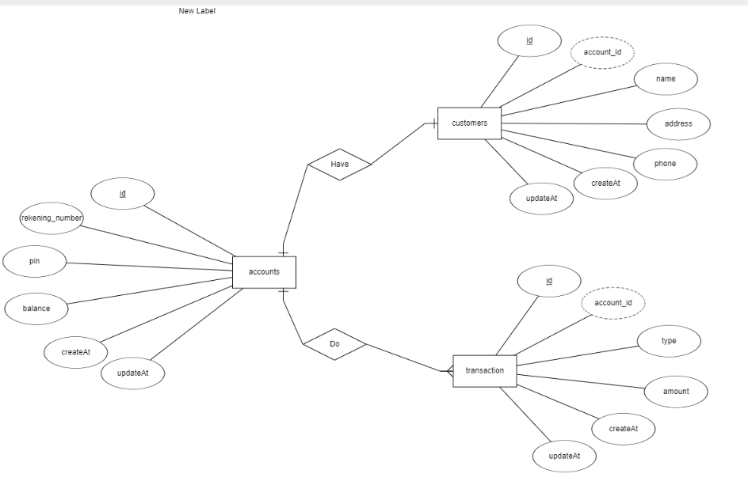
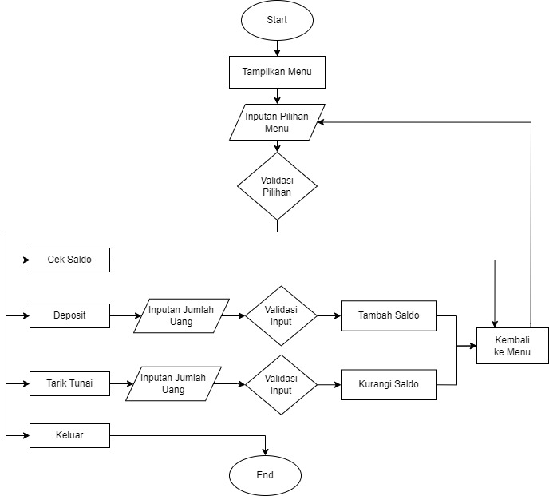

### Muhamad Royhan Fadhli
# Taks Chapter 3

### ERD
ERD file is in the ```assets/``` folder with the name ERD.erdplus



### Database
### 1. Generate Database
- create database with query at db/generate_database.sql
``` CREATE DATABASE banking_system; ```
### 2. Make Migration Table
- Go to db/migration 
- run all queries in the ```.sql``` file located in the migration folder except for the ones in the procedure folder
### 3. Create Seeder data (Data Dummy) 
- Go to db/ seeder
- run all queries on the ```.sql``` file located in the seeder folder

### 4. You Can Continue Use All Query At :
- db/query ``` Basic Query```
- db/migration/procedure ``` Procedure Query```


# Taks Chapter 2

### For Runing The Program

```
node banking_system.js
```

### FlowChart



